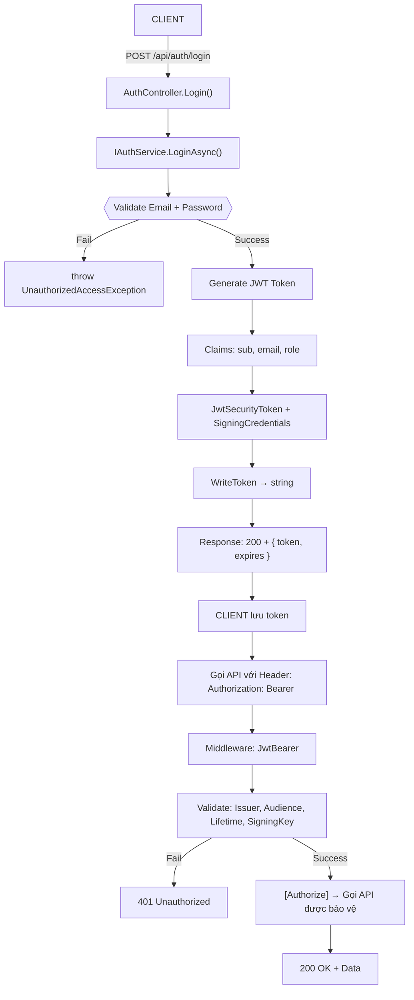
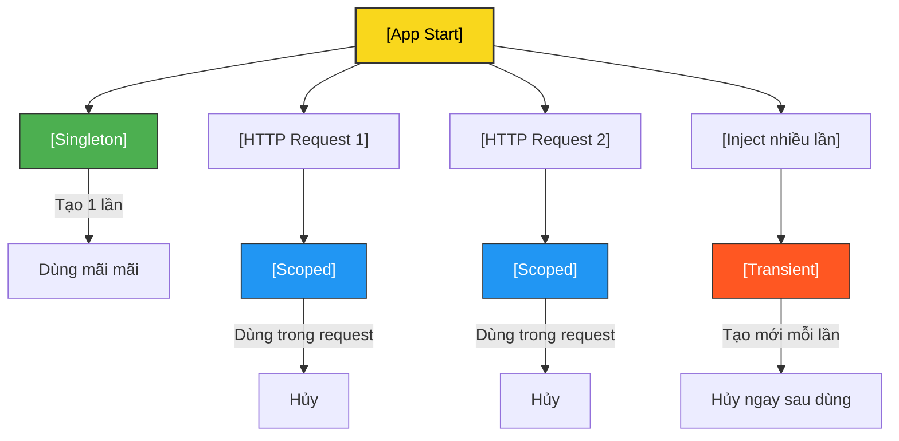
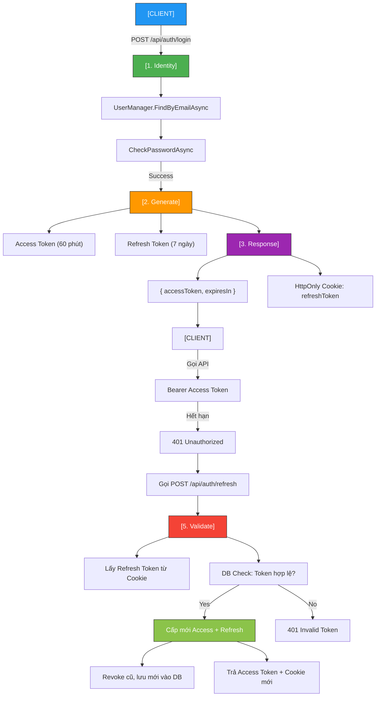
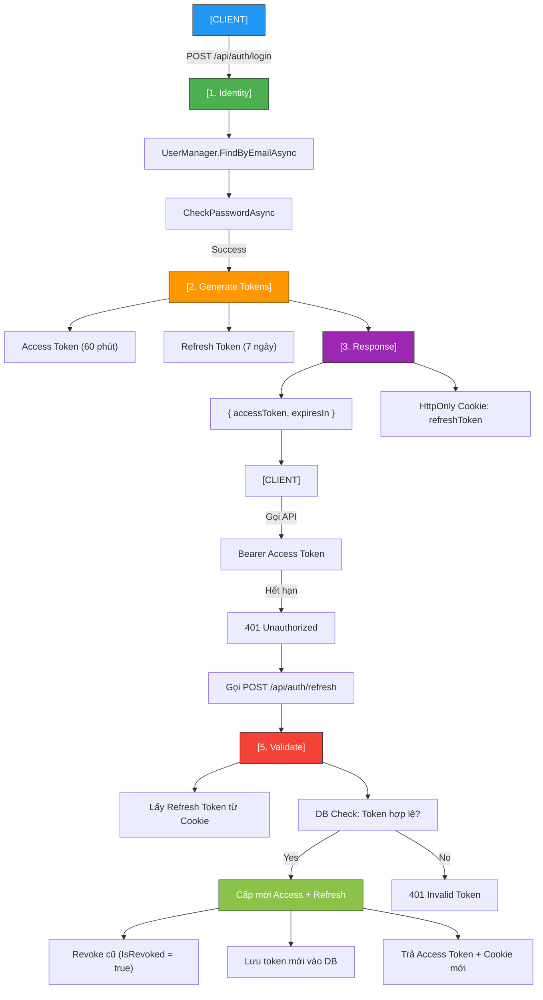
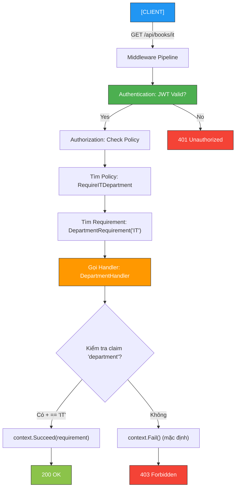
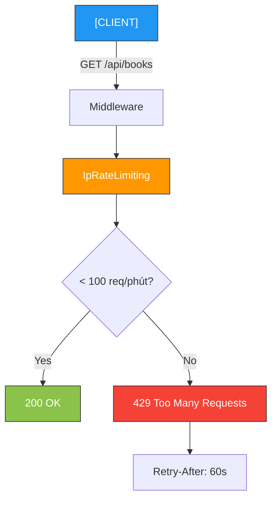
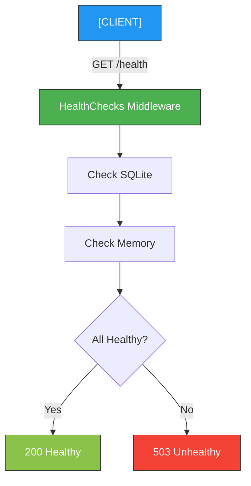
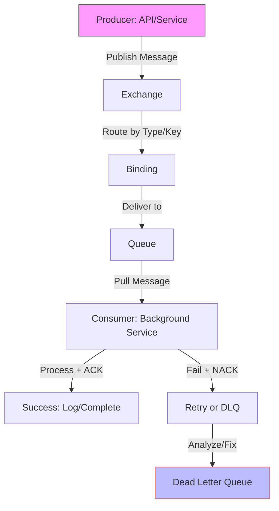

# Study .NET - Mastering ASP.NET Core 10

------------------------------------------------

## Tổng kết 4 buổi học — Kiến trúc The Standard

| Ngày | Chương | Nội dung chính | Thành tựu |
|------|--------|----------------|----------|
| **Day 1** | **Ch3** | **First Book API** | - The Standard: `Broker → Service → Controller`<br>- .NET 10 RC2 + VS 2026 Preview<br>- Swagger + XML Comments<br>- `POST /api/books` → `201 Created` |
| **Day 2** | **Ch4** | **Pipeline** | - Custom Middleware: `RequestTimingMiddleware`<br>- Built-in: `UseCors`, `UseExceptionHandler`<br>- `UseRequestTiming()` logs request duration |
| **Day 3** | **Ch6** | **Dependency Injection** | - Unit Test: `BookServiceTests` (xUnit)<br>- Integration Test: `WebApplicationFactory<Program>`<br>- .NET 10 DI Diagnostics<br>- `AddSingleton`, `AddScoped`, `AddTransient` |
| **Day 4** | **Ch7** | **Routing & Endpoints** | - Full CRUD Async Controller<br>- Attribute Routing: `{id:int}`<br>- Custom Route Constraint: `year/{year:year}` → `1800` → `404`<br>- Minimal API: `MapGet("/hello")`<br>- `GetBooksByYear` full The Standard<br>- Integration Tests: `GET /api/books/1`, `GET /api/books/year/1800` |
| **Day 5** | **Ch8** | **Model Binding & Validation** | FluentValidation, Custom Binder, `ValidationProblem()` |
| **Day 6** | **Ch9** | **Authentication & Authorization** | JWT, `[Authorize]`, `401 → 200` |
| **Day 7** | **Ch10** | **Refresh Token + Identity** | SQLite, HttpOnly Cookie, Revoke, SeedData |
| **Day 8** | **Ch11** | **Policy-Based Auth** | `RequireAdmin`, `MinimumAge`, `DepartmentHandler` |
| **Day 9** | **Ch12** | **Rate Limiting + Health Checks** | `Health Check Memory`, `Rate Limiting` |
| **Day 10** | **Ch14** | **RabbitMQ + Message Queue** | `RabbitMQ + Message Queue` |

---

## Kiến trúc The Standard — 100% hoàn chỉnh


- Tất cả đều **DI**, **testable**, **async khi cần**, **sync khi nhanh**.

---

## Công cụ & Công nghệ

| Công cụ | Phiên bản |
|--------|----------|
| .NET | **10.0 RC2** |
| IDE | Visual Studio 2026 Preview |
| Testing | xUnit + `Microsoft.AspNetCore.Mvc.Testing` |
| API Documentation | Swagger + XML Comments |
| Source Control | Git + GitHub |

---

### **DAY 1 — CHƯƠNG 3: FIRST BOOK API**

| Câu hỏi | Trả lời |
|--------|--------|
| **Bạn đã học gì ở Day 1?** | Xây API đầu tiên với The Standard |
| **The Standard gồm mấy lớp?** | 3 lớp: `Broker`, `Service`, `Controller` |
| **Swagger dùng để làm gì?** | Tạo tài liệu API tự động |
| **Tại sao không `new BookService()` trong Controller?** | Dùng DI để inject `IBookService` → dễ test |
| **XML Comments có ích gì trong Swagger?** | Hiển thị mô tả API, tham số, response |
| **Làm sao để `POST /api/books` trả về `201 Created` với URL chi tiết?** | Dùng `CreatedAtAction(nameof(Get), new { id = book.Id }, book)` |
| **Nếu `IBookService` có 2 implementation (`InMemory` và `SqlServer`), bạn chọn cái nào khi start app?** | Dùng `appsettings.json` + `IConfiguration` → `services.AddScoped<IBookService>(sp => config["Storage"] == "sql" ? new SqlBookService(...) : new InMemoryBookService(...))` |
| **Làm sao để `POST /api/books` trả về `Location: /api/books/1` ngay cả khi `Get` chưa tồn tại?** | Dùng `CreatedAtRoute("GetBook", new { id = book.Id }, book)` |

---

### **DAY 2 — CHƯƠNG 4: PIPELINE**

| Câu hỏi | Trả lời |
|--------|--------|
| **Middleware là gì?** | Hàm xử lý request/response theo thứ tự |
| **Bạn đã viết middleware nào?** | `RequestTimingMiddleware` |
| **Làm sao log thời gian xử lý request?** | Dùng `Stopwatch` trong middleware |
| **Thứ tự `UseCors()` và `MapControllers()`?** | `UseCors()` trước `MapControllers()` |
| **Nếu `UseExceptionHandler()` đặt sau `MapControllers()`, điều gì xảy ra?** | Lỗi không được bắt → trả về HTML 500 |
| **Làm sao để `RequestTimingMiddleware` chỉ chạy với `/api/books` mà không chạy với `/health`?** | Dùng `if (!context.Request.Path.StartsWithSegments("/health")) { await _next(context); }` |
| **Nếu có 2 middleware cùng log, làm sao tránh log 2 lần?** | Dùng `context.Items["Logged"] = true` để đánh dấu |

---

### **DAY 3 — CHƯƠNG 6: DEPENDENCY INJECTION**

| Câu hỏi | Trả lời |
|--------|--------|
| **DI là gì?** | Inject dependency thay vì `new` |
| **3 lifetime của DI là gì?** | `Singleton`, `Scoped`, `Transient` |
| **Unit Test cần DI không?** | Không, có thể `new BookService(broker)` |
| **Integration Test dùng gì?** | `WebApplicationFactory<Program>` |
| **Làm sao phát hiện lỗi DI (circular dependency) ngay khi start?** | Dùng `.NET 10 DI Diagnostics` → `builder.Services.AddDiagnostics()` |
| **Nếu `BookService` cần `ILogger<BookService>` và `IStorageBroker`, nhưng `InMemoryStorageBroker` cũng cần `ILogger`, có circular dependency không?** | Không, vì `ILogger` là built-in, không gây vòng |
| **Làm sao mock `IStorageBroker` trong `WebApplicationFactory` để test với dữ liệu giả?** | Dùng `ConfigureTestServices(services => services.AddScoped<IStorageBroker, FakeStorageBroker>())` |

---

### **DAY 4 — CHƯƠNG 7: ROUTING & ENDPOINTS**

| Câu hỏi | Trả lời |
|--------|--------|
| **Attribute Routing là gì?** | `[HttpGet("{id:int}")]` |
| **Minimal API viết thế nào?** | `app.MapGet("/hello", () => "Hi")` |
| **Custom Route Constraint dùng khi nào?** | Khi cần kiểm tra tham số route |
| **Bạn đã viết constraint nào?** | `year/{year:year}` → `1800` → `404` |
| **Làm sao test `GET /api/books/year/1800` trả về `404`?** | Dùng `WebApplicationFactory` + `client.GetAsync()` + `Assert.Equal(404, response.StatusCode)` |
| **Nếu `GetById(int id)` và `GetBooksByYear(int year)` đều dùng `{id:int}`, làm sao phân biệt?** | Dùng route khác: `[HttpGet("{id:int}")]`, `[HttpGet("year/{year:year}")]` |
| **Làm sao để `GetBooksByYear` trả về `200` với danh sách rỗng nếu không có sách, thay vì `404`?** | Dùng `Ok(books)` — `404` chỉ khi route không hợp lệ |

---

### **DAY 5 — CHƯƠNG 8: MODEL BINDING & VALIDATION**

| Câu hỏi | Trả lời |
|--------|--------|
| **Validation ở đâu?** | **Service** → `IBookService.Validate...Async()` |
| **FluentValidation tốt hơn Data Annotations?** | Linh hoạt, dễ test, không cần attribute |
| **Custom Model Binder dùng khi nào?** | Parse `dd-MM-yyyy`, CSV, custom format |
| **Làm sao trả `400` tự động?** | `AddFluentValidationAutoValidation()` + `ValidationProblem()` |

---

### **DAY 6: — CHƯƠNG 9: AUTHENTICATION & AUTHORIZATION**

| Câu hỏi | Trả lời |
|--------|--------|
| **JWT là gì??** | JSON Web Token — chuỗi mã hóa gồm Header, Payload, Signature. Dùng để xác thực stateless. |
| **Luồng JWT hoạt động thế nào??** | Client → Login → Server tạo token → Client lưu → Gọi API với Bearer <token> → Middleware validate → Cho phép. |
| **Tại sao không dùng Session??** | Stateless, scale tốt, không cần server lưu trạng thái. |
| **Claims dùng để làm gì??** | Lưu thông tin user: sub, email, role, name → Dùng cho [Authorize(Roles = "Admin")] |
| **Token hết hạn thì sao??** | 401 Unauthorized → Client gọi "/refresh" để lấy token mới. |
| **Làm sao bảo vệ API??** | Dùng [Authorize] + AddAuthentication("Bearer").AddJwtBearer(). |
| **Validate token ở đâu??** | Middleware → JwtBearer → TokenValidationParameters |
| **Key bí mật để làm gì??** | Ký token (SigningCredentials) → Server validate chữ ký. |
| **Refresh Token khác gì Access Token??** | Access: ngắn hạn (60p), Refresh: dài hạn (7 ngày), dùng để cấp lại Access. |
| **Tại sao không lưu password trong code???** | Dùng Identity + Hashing (PBKDF2) → Không bao giờ lưu plain text. |

## Luồng hoạt động — JWT Authentication (Mabrouk’s Pattern)

Authentication ở Service → IAuthService
Authorization ở Middleware → JwtBearer
Controller chỉ trả token hoặc gọi API


---
## Test API — Swagger vs `.http`

> **"Bạn không cần Swagger để test API — bạn chỉ cần một file `.http`."**  
> — *Mastering ASP.NET Core 10*, **p.298**

| Tiêu chí | Swagger | `BookApi.http` |
|--------|--------|----------------|
| **Tốc độ** | Chậm (mở browser) | **Siêu nhanh** (trong IDE) |
| **Debug** | Khó xem raw | **Dễ thấy header/body** |
| **Chia sẻ** | Cần URL | **Commit vào Git** |
| **Biến môi trường** | Không | **Có** (`@host`, `@token`) |
| **Dùng khi app chưa chạy** | Không | **Có (mock)** |
| **Tự động lưu token** | Không | **Có** (`client.global.set`) |

```http
POST {{host}}/api/auth/login → 200 + token
GET {{host}}/api/books/admin → 200 (có token) / 401 (không)
```
---

## DI Lifetime — Singleton vs Scoped vs Transient

> **"Singleton sống mãi, Scoped theo request, Transient mỗi lần một đời."**


---

## Luồng Refresh Token + Identity (Mabrouk’s Security Pattern)


---

## Overview Kiến Thức — The Standard (Mabrouk Mahdhi)

| Chủ đề | Kiến thức cốt lõi | Tại sao quan trọng? |
|-------|------------------|---------------------|
| **Broker → Service → Controller** | Phân tầng rõ ràng | Dễ test, dễ maintain |
| **Dependency Injection** | `Singleton`, `Scoped`, `Transient` | Kiểm soát tuổi thọ object |
| **Middleware Pipeline** | `UseHttpsRedirection` → `UseAuthentication` → `UseAuthorization` | Bảo mật đúng thứ tự |
| **FluentValidation** | Tách riêng validator | Không nhầm lẫn với model |
| **JWT + Refresh Token** | Access (60p) + Refresh (7 ngày) | Bảo mật, chống replay |
| **ASP.NET Core Identity** | `UserManager`, `SignInManager` | Quản lý user chuyên nghiệp |
| **HttpOnly Cookie** | Lưu Refresh Token | Chống XSS |
| **SeedData** | Tạo user tự động | `bookapi.db` có dữ liệu ngay |

---

| Câu hỏi | Trả lời ngắn gọn | Trả lời chi tiết |
|--------|------------------|------------------|
| **DI Scoped dùng khi nào?** | Mỗi HTTP request | `DbContext`, `User` |
| **Refresh Token lưu ở đâu?** | DB + HttpOnly Cookie | Không trong JWT → chống replay |
| **Làm sao test API nhanh?** | Dùng `.http` file | Không cần Swagger |
| **Tại sao `UseAuthentication` trước `UseAuthorization`?** | Xác thực → mới phân quyền | Middleware pipeline |
| **Làm sao có user trong `bookapi.db`?** | `SeedData` hoặc `/register` | Tự động tạo `admin@book.com` |
| **Custom Binder dùng để làm gì?** | Parse `dd-MM-yyyy` → `DateTime` | Không cần `[FromQuery]` |
| **Làm sao revoke Refresh Token?** | `IsRevoked = true` | Cấp mới, xóa cũ |

---

### **DAY 7 — CHƯƠNG 10: Refresh Token + Identity**

| STT | Câu hỏi                               | Trả lời ngắn gọn                       | Trả lời chi tiết (phỏng vấn)                                      |
|-----|----------------------------------------|------------------------------------------|--------------------------------------------------------------------|
| 1   | Refresh Token lưu ở đâu?               | DB + HttpOnly Cookie                    | Không lưu trong JWT → chống replay attack. Lưu trong bảng RefreshTokens, HttpOnly → chống XSS |
| 2   | Tại sao không gửi Refresh Token trong JSON? | Dễ bị XSS                              | HttpOnly Cookie → JS không đọc được                               |
| 3   | Revoke Refresh Token thế nào?          | IsRevoked = true                         | Khi refresh → xóa token cũ, cấp token mới                         |
| 4   | Access Token hết hạn → 401 → làm gì?   | Gọi /refresh                             | Client tự động gọi /api/auth/refresh                              |
| 5   | Làm sao có user trong bookapi.db?      | SeedData hoặc /register                  | SeedData.InitializeAsync() → tạo admin@book.com                   |
| 6   | Refresh Token có trong JWT không?      | Không                                    | JWT chỉ chứa Access Token (60 phút)                               |
| 7   | HttpOnly Cookie có an toàn không?      | Có                                       | Chống XSS, nhưng cần HTTPS                                        |
| 8   | Refresh Token hết hạn sau bao lâu?     | 7 ngày                                   | DateTime.UtcNow.AddDays(7)                                        |

---

### **Luồng Refresh Token + Identity**


---

## `AuthorizationHandler` — Người quyết định quyền truy cập

> **"Policy chỉ định yêu cầu — Handler kiểm tra thực tế."**

### Cấu trúc
```csharp
protected override Task HandleRequirementAsync(
    AuthorizationHandlerContext context,
    TRequirement requirement)
{
    if (điều_kiện) context.Succeed(requirement);
    return Task.CompletedTask;
}
```
---

### **DAY 8 — CHƯƠNG 11: Policy-Based Authorization**

| STT | Câu hỏi                                | Trả lời ngắn gọn                         | Trả lời chi tiết (phỏng vấn)                                       |
|-----|-----------------------------------------|-------------------------------------------|---------------------------------------------------------------------|
| 9   | Policy khác Role thế nào?               | Linh hoạt hơn                             | Role cứng nhắc, Policy dùng Requirement + Handler                  |
| 10  | AuthorizationHandler làm gì?            | Kiểm tra requirement                      | Gọi context.Succeed() hoặc Fail()                                  |
| 11  | context.Succeed() vs Fail()?            | Cho phép / Từ chối                        | Succeed() → 200, Fail() → 403                                      |
| 12  | Policy đăng ký ở đâu?                   | Program.cs                                | builder.Services.AddAuthorization()                                 |
| 13  | Handler đăng ký thế nào?                | AddScoped<IAuthorizationHandler, ...>     | Mỗi request 1 instance                                              |
| 14  | Dùng claim age trong Policy được không? | Được                                      | FindFirst("age") → int.TryParse                                     |
| 15  | Tại sao không dùng [Authorize(Roles)]?  | Không linh hoạt                           | Không kiểm tra claim tùy chỉnh                                     |
| 16  | Handler có cần async không?             | Không                                     | Trả Task.CompletedTask                                              |

---

##Luồng Policy-Based Authorization


---

### **Day 9 — Chương 12: Rate Limiting + Health Checks**

| Khái niệm              | Mô tả                              | Ví dụ / Endpoint                     |
|-----------------------|-------------------------------------|---------------------------------------|
| **Health Checks**     | Kiểm tra trạng thái API             | `/health` → `"Healthy"`               |
| **Health UI**         | Dashboard trực quan                 | `/health-ui` → biểu đồ đẹp           |
| **AddSqlite**         | Kiểm tra kết nối DB                 | SQLite connected?                     |
| **AddProcessHealthCheck** | Kiểm tra memory của process     | RAM < 1GB → Healthy, > 1GB → Degraded

| Câu hỏi                          | Trả lời ngắn                   | Trả lời chi tiết |
|----------------------------------|---------------------------------|------------------|
| **Health Check Memory .NET 10?** | `AddProcessHealthCheck` + lambda |------------------|
| **Package cho Memory?** | `AspNetCore.HealthChecks.System` |------------------|
| **Rate Limiting chống DDoS?** | `AspNetCoreRateLimit` + `GeneralRules` |------------------|
| **Rate Limiting chống DDoS?**    | `AspNetCoreRateLimit`           | **GeneralRules**: 120 req/phút, whitelist localhost |
| **Health Check trong .NET 10?**  | `AddProcessHealthCheck`         | Kiểm tra memory, SQLite → `/health-ui` |
| **Package cho Memory Check?**    | `AspNetCore.HealthChecks.System` | Dùng `AddProcessHealthCheck` + lambda |
| **Custom 429 response?**         | JSON + `Retry-After`            | Middleware: `Use(async (context, next) => { await next(); if (429) ... })` |
| **Health UI config?**            | `AddHealthChecksUI`             | `EvaluationTimeInSeconds(10)`, `MaximumHistoryEntriesPerEndpoint(60)` |

## SO SÁNH — KHÔNG RATE LIMITING VS CÓ

|                     | **Không Rate Limiting** | **Có Rate Limiting**       |
|---------------------|--------------------------|-----------------------------|
| DDoS > 500 req/s    | 500 lỗi (Internal)       | **429 + Retry-After**       |
| API chậm            | Không bảo vệ tài nguyên  | **Bảo vệ tài nguyên**       |
| Client spam         | Không kiểm soát          | **Tự động chặn IP**         |

---

## MERMAID — RATE LIMITING FLOW



---

## MERMAID — HEALTH CHECKS FLOW



---

### **Day 14 — Chương 14: RabbitMQ + Message Queue**

| Khái niệm                                 |Trả lời ngắn                                   | Trả lời chi tiết                       |
|-------------------------------------------|-----------------------------------------------|----------------------------------------|
|**Message Queue**                          |Giao tiếp bất đồng bộ, tách Producer ↔ Consumer|Xử lý gửi email, log, nhiệm vụ nặng     |
|**RabbitMQ (AMQP Broker)**                 |Nhận, lưu, phân phối message                   |rabbitmq:3-management                   |
|**Exchange**                               |Nhận message và route đến Queue                |Fanout / Direct / Topic                 |
|**Fanout Exchange**                        |Broadcast đến tất cả Queue                     |Thông báo sự kiện                       |
|**Direct Exchange**                        |Route theo routing key chính xác               |email.created                           |
|**Topic Exchange**                         |Route theo pattern                             |logs.error.\*                           |
|**Durable Queue**                          |Tồn tại sau restart                            |Lưu message lâu dài                     |
|**DLQ (Dead Letter Queue)**                |Lưu message lỗi để xử lý sau                   |Queue \*.dlq                            |
|**Consumer**                               |Dịch vụ xử lý message                          |BackgroundService / MassTransit Consumer|
|**ACK / NACK**                             |Xác nhận thành công / thất bại                 |ACK = OK, NACK = retry hoặc DLQ         |
|**RabbitMQ dùng để làm gì?**               |Xử lý bất đồng bộ                              |Tách API và worker, tránh block request, phù hợp event-driven|
|**Exchange hoạt động ra sao?**             |Nhận + route message                           |Fanout (broadcast), Direct (match key), Topic (pattern)|
|**Routing Key là gì?**                     |Chuỗi điều hướng message                       |Exchange Direct/Topic dùng routing key để chọn queue đích|
|**Queue Durable nghĩa là gì?**             |Không mất khi restart                          |Tối ưu cho hệ thống cần reliability cao|
|**DLQ dùng khi nào?**                      |Message lỗi nhiều lần                          |Giữ các message thất bại để debug hoặc xử lý lại|
|**MassTransit hỗ trợ gì?**                 |Publish/Consume đơn giản                       |Tự declare queue, handle retry, serialization, background consumer|
|**Retry trong RabbitMQ thực hiện thế nào?**|Immediate / Interval / Backoff                 |Retry 3–5 lần → đưa vào DLQ nếu vẫn lỗi|
|**Auto-Ack có nguy hiểm không?**           |Có                                             |Auto-ack làm mất message nếu consumer crash giữa chừng|
|**Testing RabbitMQ thế nào?**              |Testcontainers                                 |Spin-up RabbitMQ thật trong integration test để verify publish/consume|
|**Lỗi Queue Not Declared?**                |Chưa tạo queue                                 |Declare queue trước khi publish hoặc dùng MassTransit auto-create|

---

##Workflow for RabbitMQ Integration



---
## 1\. **Message Queue là gì?**

*   Là **hàng đợi chứa các “việc cần làm”**.
*   Khi API nhận request nặng → **không làm ngay** → chỉ **đẩy công việc vào queue**, còn xử lý sẽ do **background worker** làm sau.
*   Lợi ích:
*   API chạy nhanh, không bị nghẽn.
*   Không bị crash khi traffic tăng đột biến.
*   Tách biệt (decouple) giữa API và service xử lý nặng.

👉 Ví dụ dễ hiểu:
*   Người dùng bấm: “Gửi email”.
*   API **không tự gửi email**, nó chỉ **đẩy 1 message vào queue**.
*   Worker (consumer) âm thầm xử lý → gửi email.

## 2\. RabbitMQ là gì?

RabbitMQ là một **message broker** – phần mềm giúp:
*   Nhận message
*   Lưu vào queue
*   Phân phối tới “consumer” xử lý
*   Đảm bảo không mất dữ liệu (nếu cấu hình durable + persist)
Nó giống như **bưu điện**, còn message giống **thư**.

RabbitMQ hỗ trợ:
*   Exchange (quyết định message đi đâu)
*   Queue (nơi lưu)
*   Routing (điều hướng)
*   ACK/NACK (báo là đã xử lý xong hoặc thất bại).

## 3\. Tại sao ASP.NET Core nên dùng RabbitMQ?

*   API không bị chậm do xử lý nặng.
*   Giảm tải database.
*   Dùng rất phù hợp cho microservices.
*   Có retry + DLQ → message lỗi không bị mất.
*   Traffic tăng cao vẫn chạy mượt vì queue sẽ đỡ “sốc”.

**Ví dụ thực tế trong API của bạn**
*   Upload file lớn.
*   Send email, SMS.
*   Đồng bộ dữ liệu sang hệ thống khác.
*   Xử lý báo cáo, thống kê.

## 4\. Tích hợp RabbitMQ trong ASP.NET Core (dễ hiểu nhất)

Dùng thư viện **MassTransit**:
*   Cấu hình RabbitMQ trong DI.
*   Trong Controller → gọi `IPublishEndpoint.Publish()`.
*   Trong Worker → implement `IConsumer<T>` để xử lý message.
*   Như vậy API = producer; worker = consumer.

## 5\. Các Exchange của RabbitMQ

|Loại         |Dùng khi                                         |
|-------------|-------------------------------------------------|
|**Fanout**   |Gửi 1 message → tất cả queue đều nhận (broadcast)|
|**Direct**   |Gửi theo đúng routing key                        |
|**Topic**    |Gửi theo pattern, kiểu "order.*"                 |
|**Headers**  |Lọc message bằng header                          |

## 6\. Durable, Auto-Delete, Exclusive là gì?

*   **Durable** → queue sống sau khi RabbitMQ restart (nên bật trong production).
*   **Auto-delete** → queue tự xóa khi không còn ai sử dụng.
*   **Exclusive** → chỉ 1 connection dùng được, đóng app là mất luôn.

## 7\. Dead Letter Queue (DLQ)

*   Khi message lỗi N lần → RabbitMQ chuyển qua DLQ.
*   Mục đích:
*   Không làm “kẹt” queue chính.
*   Không mất message lỗi → còn để kiểm tra thủ công.
Trong MassTransit thì DLQ + Retry đã có built-in.

## 8\. Retry & Backoff

*   Consumer xử lý lỗi → thử lại (retry).
*   Exponential backoff: 1s → 5s → 30s → 2 phút …
*   Tránh tình trạng “spam retry” gây vỡ hệ thống.

## 9\. Khi nào nên dùng Queue trong kiến trúc "The Standard"?

*   Tách API khỏi background process.
*   Hệ thống có xử lý nặng / chạy lâu.
*   Muốn hệ thống ổn định, scale tốt.

## 10\. Lỗi RabbitMQ phổ biến

*   Queue not found → quên declare.
*   Mất message → chưa bật persistent/durable.
*   Auto-ack → chưa xử lý xong mà ack → mất dữ liệu.
*   Channel closed → retry lại kết nối.

## 11\. RabbitMQ vs Kafka (ngắn gọn)

|RabbitMQ                           |Kafka                                  |
|-----------------------------------|---------------------------------------|
|Task queue, routing linh hoạt      |Xử lý streaming dữ liệu lớn            |
|Message “biến mất” sau khi xử lý   |Message giữ lại lâu (log)              |
|Dễ dùng                            |Phức tạp hơn                           |
|Dùng cho API và microservices      |Dùng cho phân tích dữ liệu, events lớn |


