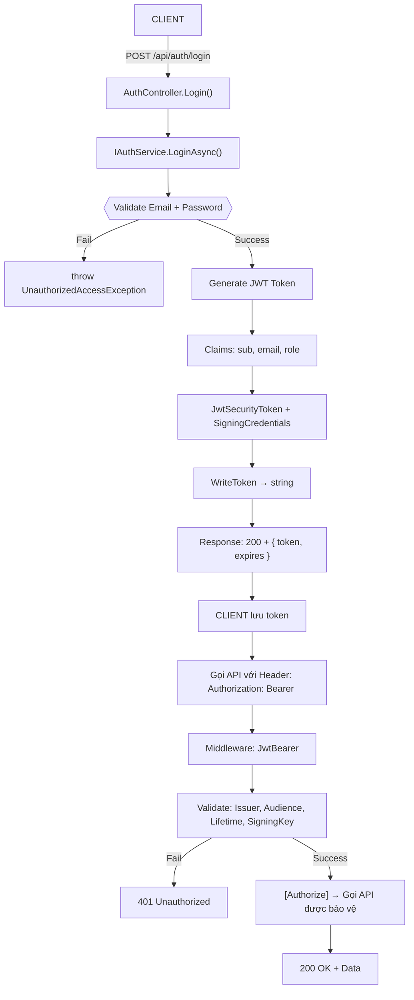
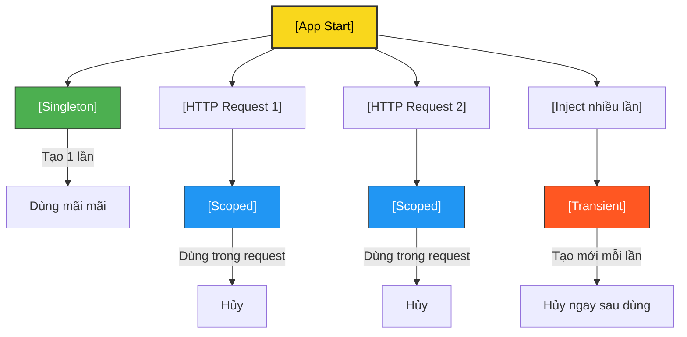
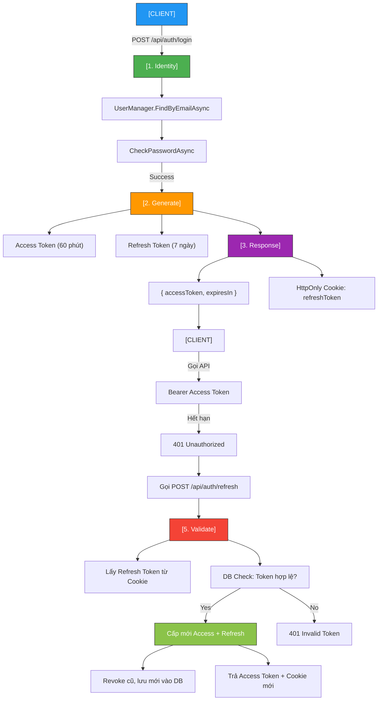

# Study .NET - Mastering ASP.NET Core 10

------------------------------------------------

## Tổng kết 4 buổi học — Kiến trúc The Standard

| Ngày | Chương | Nội dung chính | Thành tựu |
|------|--------|----------------|----------|
| **Day 1** | **Ch3** | **First Book API** | - The Standard: `Broker → Service → Controller`<br>- .NET 10 RC2 + VS 2026 Preview<br>- Swagger + XML Comments<br>- `POST /api/books` → `201 Created` |
| **Day 2** | **Ch4** | **Pipeline** | - Custom Middleware: `RequestTimingMiddleware`<br>- Built-in: `UseCors`, `UseExceptionHandler`<br>- `UseRequestTiming()` logs request duration |
| **Day 3** | **Ch6** | **Dependency Injection** | - Unit Test: `BookServiceTests` (xUnit)<br>- Integration Test: `WebApplicationFactory<Program>`<br>- .NET 10 DI Diagnostics<br>- `AddSingleton`, `AddScoped`, `AddTransient` |
| **Day 4** | **Ch7** | **Routing & Endpoints** | - Full CRUD Async Controller<br>- Attribute Routing: `{id:int}`<br>- Custom Route Constraint: `year/{year:year}` → `1800` → `404`<br>- Minimal API: `MapGet("/hello")`<br>- `GetBooksByYear` full The Standard<br>- Integration Tests: `GET /api/books/1`, `GET /api/books/year/1800` |
| **Day 5** | **Ch8** | **Model Binding & Validation** | FluentValidation, Custom Binder, `ValidationProblem()` |
| **Day 6** | **Ch9** | **Authentication & Authorization** | JWT, `[Authorize]`, `401 → 200` |
| **Day 7** | **Ch10** | **Refresh Token + Identity** | SQLite, HttpOnly Cookie, Revoke, SeedData |
| **Day 8** | **Ch11** | **Policy-Based Auth** | `RequireAdmin`, `MinimumAge`, `DepartmentHandler` |

---

## Kiến trúc The Standard — 100% hoàn chỉnh


- Tất cả đều **DI**, **testable**, **async khi cần**, **sync khi nhanh**.

---

## Công cụ & Công nghệ

| Công cụ | Phiên bản |
|--------|----------|
| .NET | **10.0 RC2** |
| IDE | Visual Studio 2026 Preview |
| Testing | xUnit + `Microsoft.AspNetCore.Mvc.Testing` |
| API Documentation | Swagger + XML Comments |
| Source Control | Git + GitHub |

---

### **DAY 1 — CHƯƠNG 3: FIRST BOOK API**

| Câu hỏi | Trả lời |
|--------|--------|
| **Bạn đã học gì ở Day 1?** | Xây API đầu tiên với The Standard |
| **The Standard gồm mấy lớp?** | 3 lớp: `Broker`, `Service`, `Controller` |
| **Swagger dùng để làm gì?** | Tạo tài liệu API tự động |
| **Tại sao không `new BookService()` trong Controller?** | Dùng DI để inject `IBookService` → dễ test |
| **XML Comments có ích gì trong Swagger?** | Hiển thị mô tả API, tham số, response |
| **Làm sao để `POST /api/books` trả về `201 Created` với URL chi tiết?** | Dùng `CreatedAtAction(nameof(Get), new { id = book.Id }, book)` |
| **Nếu `IBookService` có 2 implementation (`InMemory` và `SqlServer`), bạn chọn cái nào khi start app?** | Dùng `appsettings.json` + `IConfiguration` → `services.AddScoped<IBookService>(sp => config["Storage"] == "sql" ? new SqlBookService(...) : new InMemoryBookService(...))` |
| **Làm sao để `POST /api/books` trả về `Location: /api/books/1` ngay cả khi `Get` chưa tồn tại?** | Dùng `CreatedAtRoute("GetBook", new { id = book.Id }, book)` |

---

### **DAY 2 — CHƯƠNG 4: PIPELINE**

| Câu hỏi | Trả lời |
|--------|--------|
| **Middleware là gì?** | Hàm xử lý request/response theo thứ tự |
| **Bạn đã viết middleware nào?** | `RequestTimingMiddleware` |
| **Làm sao log thời gian xử lý request?** | Dùng `Stopwatch` trong middleware |
| **Thứ tự `UseCors()` và `MapControllers()`?** | `UseCors()` trước `MapControllers()` |
| **Nếu `UseExceptionHandler()` đặt sau `MapControllers()`, điều gì xảy ra?** | Lỗi không được bắt → trả về HTML 500 |
| **Làm sao để `RequestTimingMiddleware` chỉ chạy với `/api/books` mà không chạy với `/health`?** | Dùng `if (!context.Request.Path.StartsWithSegments("/health")) { await _next(context); }` |
| **Nếu có 2 middleware cùng log, làm sao tránh log 2 lần?** | Dùng `context.Items["Logged"] = true` để đánh dấu |

---

### **DAY 3 — CHƯƠNG 6: DEPENDENCY INJECTION**

| Câu hỏi | Trả lời |
|--------|--------|
| **DI là gì?** | Inject dependency thay vì `new` |
| **3 lifetime của DI là gì?** | `Singleton`, `Scoped`, `Transient` |
| **Unit Test cần DI không?** | Không, có thể `new BookService(broker)` |
| **Integration Test dùng gì?** | `WebApplicationFactory<Program>` |
| **Làm sao phát hiện lỗi DI (circular dependency) ngay khi start?** | Dùng `.NET 10 DI Diagnostics` → `builder.Services.AddDiagnostics()` |
| **Nếu `BookService` cần `ILogger<BookService>` và `IStorageBroker`, nhưng `InMemoryStorageBroker` cũng cần `ILogger`, có circular dependency không?** | Không, vì `ILogger` là built-in, không gây vòng |
| **Làm sao mock `IStorageBroker` trong `WebApplicationFactory` để test với dữ liệu giả?** | Dùng `ConfigureTestServices(services => services.AddScoped<IStorageBroker, FakeStorageBroker>())` |

---

### **DAY 4 — CHƯƠNG 7: ROUTING & ENDPOINTS**

| Câu hỏi | Trả lời |
|--------|--------|
| **Attribute Routing là gì?** | `[HttpGet("{id:int}")]` |
| **Minimal API viết thế nào?** | `app.MapGet("/hello", () => "Hi")` |
| **Custom Route Constraint dùng khi nào?** | Khi cần kiểm tra tham số route |
| **Bạn đã viết constraint nào?** | `year/{year:year}` → `1800` → `404` |
| **Làm sao test `GET /api/books/year/1800` trả về `404`?** | Dùng `WebApplicationFactory` + `client.GetAsync()` + `Assert.Equal(404, response.StatusCode)` |
| **Nếu `GetById(int id)` và `GetBooksByYear(int year)` đều dùng `{id:int}`, làm sao phân biệt?** | Dùng route khác: `[HttpGet("{id:int}")]`, `[HttpGet("year/{year:year}")]` |
| **Làm sao để `GetBooksByYear` trả về `200` với danh sách rỗng nếu không có sách, thay vì `404`?** | Dùng `Ok(books)` — `404` chỉ khi route không hợp lệ |

---

### **DAY 5 — CHƯƠNG 8: MODEL BINDING & VALIDATION**

| Câu hỏi | Trả lời |
|--------|--------|
| **Validation ở đâu?** | **Service** → `IBookService.Validate...Async()` |
| **FluentValidation tốt hơn Data Annotations?** | Linh hoạt, dễ test, không cần attribute |
| **Custom Model Binder dùng khi nào?** | Parse `dd-MM-yyyy`, CSV, custom format |
| **Làm sao trả `400` tự động?** | `AddFluentValidationAutoValidation()` + `ValidationProblem()` |

---

### **DAY 6: — CHƯƠNG 9: AUTHENTICATION & AUTHORIZATION**

| Câu hỏi | Trả lời |
|--------|--------|
| **JWT là gì??** | JSON Web Token — chuỗi mã hóa gồm Header, Payload, Signature. Dùng để xác thực stateless. |
| **Luồng JWT hoạt động thế nào??** | Client → Login → Server tạo token → Client lưu → Gọi API với Bearer <token> → Middleware validate → Cho phép. |
| **Tại sao không dùng Session??** | Stateless, scale tốt, không cần server lưu trạng thái. |
| **Claims dùng để làm gì??** | Lưu thông tin user: sub, email, role, name → Dùng cho [Authorize(Roles = "Admin")] |
| **Token hết hạn thì sao??** | 401 Unauthorized → Client gọi "/refresh" để lấy token mới. |
| **Làm sao bảo vệ API??** | Dùng [Authorize] + AddAuthentication("Bearer").AddJwtBearer(). |
| **Validate token ở đâu??** | Middleware → JwtBearer → TokenValidationParameters |
| **Key bí mật để làm gì??** | Ký token (SigningCredentials) → Server validate chữ ký. |
| **Refresh Token khác gì Access Token??** | Access: ngắn hạn (60p), Refresh: dài hạn (7 ngày), dùng để cấp lại Access. |
| **Tại sao không lưu password trong code???** | Dùng Identity + Hashing (PBKDF2) → Không bao giờ lưu plain text. |

## Luồng hoạt động — JWT Authentication (Mabrouk’s Pattern)

Authentication ở Service → IAuthService
Authorization ở Middleware → JwtBearer
Controller chỉ trả token hoặc gọi API


---
## Test API — Swagger vs `.http`

> **"Bạn không cần Swagger để test API — bạn chỉ cần một file `.http`."**  
> — *Mastering ASP.NET Core 10*, **p.298**

| Tiêu chí | Swagger | `BookApi.http` |
|--------|--------|----------------|
| **Tốc độ** | Chậm (mở browser) | **Siêu nhanh** (trong IDE) |
| **Debug** | Khó xem raw | **Dễ thấy header/body** |
| **Chia sẻ** | Cần URL | **Commit vào Git** |
| **Biến môi trường** | Không | **Có** (`@host`, `@token`) |
| **Dùng khi app chưa chạy** | Không | **Có (mock)** |
| **Tự động lưu token** | Không | **Có** (`client.global.set`) |

```http
POST {{host}}/api/auth/login → 200 + token
GET {{host}}/api/books/admin → 200 (có token) / 401 (không)
```
---

## DI Lifetime — Singleton vs Scoped vs Transient

> **"Singleton sống mãi, Scoped theo request, Transient mỗi lần một đời."**


---

## Luồng Refresh Token + Identity (Mabrouk’s Security Pattern)


---

## Overview Kiến Thức — The Standard (Mabrouk Mahdhi)

| Chủ đề | Kiến thức cốt lõi | Tại sao quan trọng? |
|-------|------------------|---------------------|
| **Broker → Service → Controller** | Phân tầng rõ ràng | Dễ test, dễ maintain |
| **Dependency Injection** | `Singleton`, `Scoped`, `Transient` | Kiểm soát tuổi thọ object |
| **Middleware Pipeline** | `UseHttpsRedirection` → `UseAuthentication` → `UseAuthorization` | Bảo mật đúng thứ tự |
| **FluentValidation** | Tách riêng validator | Không nhầm lẫn với model |
| **JWT + Refresh Token** | Access (60p) + Refresh (7 ngày) | Bảo mật, chống replay |
| **ASP.NET Core Identity** | `UserManager`, `SignInManager` | Quản lý user chuyên nghiệp |
| **HttpOnly Cookie** | Lưu Refresh Token | Chống XSS |
| **SeedData** | Tạo user tự động | `bookapi.db` có dữ liệu ngay |

---

| Câu hỏi | Trả lời ngắn gọn | Trả lời chi tiết |
|--------|------------------|------------------|
| **DI Scoped dùng khi nào?** | Mỗi HTTP request | `DbContext`, `User` |
| **Refresh Token lưu ở đâu?** | DB + HttpOnly Cookie | Không trong JWT → chống replay |
| **Làm sao test API nhanh?** | Dùng `.http` file | Không cần Swagger |
| **Tại sao `UseAuthentication` trước `UseAuthorization`?** | Xác thực → mới phân quyền | Middleware pipeline |
| **Làm sao có user trong `bookapi.db`?** | `SeedData` hoặc `/register` | Tự động tạo `admin@book.com` |
| **Custom Binder dùng để làm gì?** | Parse `dd-MM-yyyy` → `DateTime` | Không cần `[FromQuery]` |
| **Làm sao revoke Refresh Token?** | `IsRevoked = true` | Cấp mới, xóa cũ |

---

##Luồng Refresh Token + Identity


---
